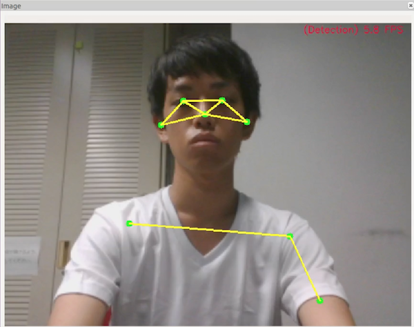

# TPU-Posenet on ROS2
Edge TPU Accelerator + Posenet + Python + Sync + LaptopPC **"+ ROS2"**.  
Inspired by **[google-coral/project-posenet](https://github.com/google-coral/project-posenet)** and **[PINTO0309/TPU-Posenet](https://github.com/PINTO0309/TPU-Posenet)**.  
This repository makes it possible to perform Posenet estimation using TPU on ROS2. 

## 0. Table of contents
**1. [Environment](#1-environment)**  
**2. [Inference result](#2-inference-result)**  
**3. [Introduction procedure](#3-introduction-procedure)**  
**4. [Usage](#4-usage)**  
**5. [Reference articles](#5-reference-articles)**  

## 1. Environment

- Ubuntu 16.04
- (ROS 1 Kinetic) -> not need. But if you have already installed, you can ros1-ros2 bridge.
- ROS 2 Ardent
- OpenCV4.1.1-openvino
- Cv_bridge on python3
- Coral Edge TPU Accelerator
- USB Camera or ROSBAG
- Self-powered USB 3.0 Hub
- Python 3.5.2+

## 2. Inference result


## 3. Introduction procedure
Install Edge TPU API and download models.

```bash
$ sudo apt-get update;sudo apt-get upgrade -y

$ sudo apt-get install -y python3-pip
$ sudo pip3 install pip --upgrade
$ sudo pip3 install numpy

$ wget https://dl.google.com/coral/edgetpu_api/edgetpu_api_latest.tar.gz -O edgetpu_api.tar.gz --trust-server-names
$ tar xzf edgetpu_api.tar.gz
$ sudo edgetpu_api/install.sh

$ git clone https://github.com/shunchan0677/TPU-Posenet.git
$ cd TPU-Posenet.git
$ cd models;./download.sh;cd ..
```

Install ROS2 and Cv_bridge.
```bash
### Install ROS2

sudo apt update && sudo apt install curl gnupg2 lsb-release
curl -s https://raw.githubusercontent.com/ros/rosdistro/master/ros.asc | sudo apt-key add -
sudo sh -c 'echo "deb [arch=amd64,arm64] http://packages.ros.org/ros2/ubuntu `lsb_release -cs` main" > /etc/apt/sources.list.d/ros2-latest.list'
export CHOOSE_ROS_DISTRO=ardent
sudo apt update

sudo apt install ros-$CHOOSE_ROS_DISTRO-desktop
sudo apt update
sudo apt install ros-$CHOOSE_ROS_DISTRO-rmw-opensplice-cpp # for OpenSplice
sudo apt install ros-$CHOOSE_ROS_DISTRO-rmw-connext-cpp # for RTI Connext (requires license agreement)

### for ros1-ros2 bridge
sudo apt update
sudo apt install ros-$CHOOSE_ROS_DISTRO-ros1-bridge


### Build cv_bridge for python3
git clone https://github.com/ros-perception/vision_opencv.git
cd vision_opencv
git checkout ros2
vim CMakeLists.txt # Change Boost REQUIRED python -> python3(line18, 22)

colcon build --symlink-install

```

## 4. Usage

Publish image topic on ROS2 (need usb-camera)

```bash
source /opt/ros/ardent/setup.bash
ros2 run image_tools cam2image
```

Subscrive image topic and Estimate pose
```bash
source /opt/ros/ardent/setup.bash
source /home/<user>/vision_opencv/install/local_setup.bash
python3 pose_camera_sigle_tpu.py
```

Show Result Image on Rviz2

```bash
source /opt/ros/ardent/setup.bash
rviz2
```

If you want to ROS2-ROS1 bridge...(need to launch roscore)

```bash
source /opt/ros/ardent/setup.bash
ros2 run ros1_bridge dynamic_bridge --bridge-all-topics
```


## 5. Reference articles
**[Edge TPU USB Accelerator analysis - I/O data transfer - Qiita - iwatake2222](https://qiita.com/iwatake2222/items/922f02893355b30dab2e)**  

**[[150 FPS ++] Connect three Coral Edge TPU accelerators and infer in parallel processing to get ultra-fast object detection inference performance ーTo the extreme of useless high performanceー - Qiita - PINTO](https://qiita.com/PINTO/items/63b6f01eb22a5ab97901#%EF%BC%91introduction-1)**  

**ROS index : Installing ROS2 via Debian Packages (https://index.ros.org/doc/ros2/Installation/Crystal/Linux-Install-Debians/#install-additional-packages-using-ros-1-packages)**


**ROS index : cv_bridge (https://index.ros.org//p/cv_bridge/github-ros-perception-vision_opencv/)**

**ROS 1とROS 2のつながり（ros1_bridge）
(https://gbiggs.github.io/rosjp_ros2_intro/ros1_bridge.html)**

**image callback in python very slow(https://github.com/ros2/ros2/issues/509)**
